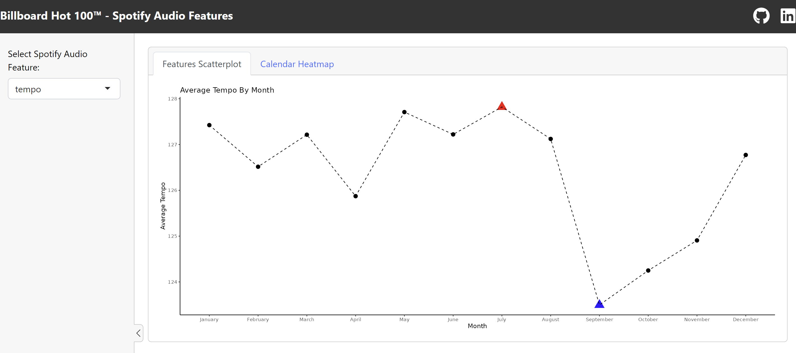
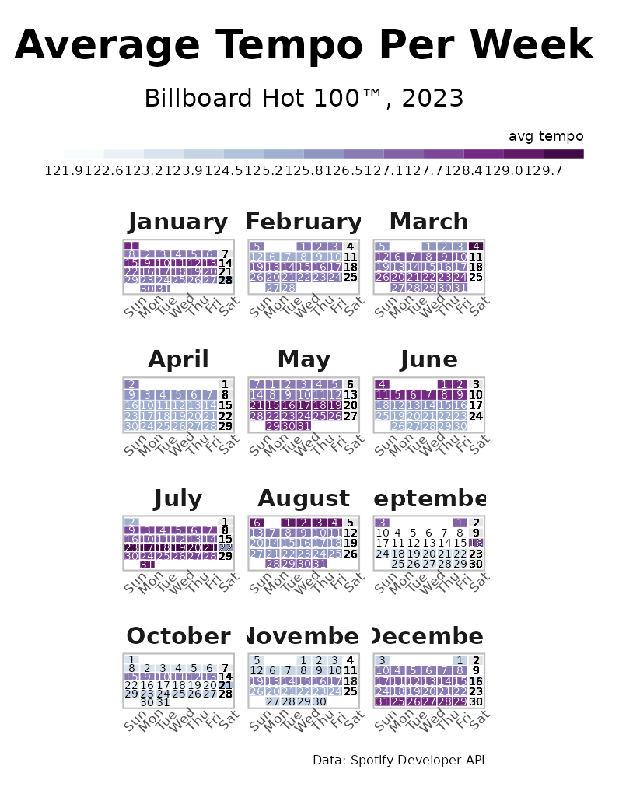

# Billboard Hot 100™ - Spotify Audio Features
 

[Billboard Hot 100™](https://www.billboard.com/charts/hot-100/) hosts lists of popular songs by week for the past several decades.
Using the [Spotify Developer Web API](https://developer.spotify.com/documentation/web-api), you can see how audio features such as energy levels and tempo have changed over time.

### Shiny R App
View the [Shiny R application](https://kjlord-tora0mullings.shinyapps.io/Billboard100SpotifyAudioFeatures/) to see how these features have changed over 2023. Screenshots below.

### Tempo in 2023

## Under Construction
**DIY Billboard Hot 100 Scrape Tool**

1. Clone application and run.
2. Choose the date range of the Billboard that you want to scrape.
3. Receive your data in a CSV file for your own use.

---
## Credits
- Dr. Dominic Royé's [calendar heatmap example](https://dominicroye.github.io/en/2020/a-heatmap-as-calendar/)

